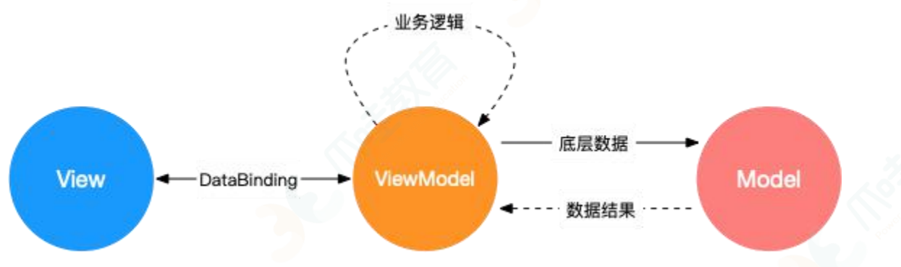

- [1. React/Vue列表为什么要key](#1-reactvue列表为什么要key)
- [2. \['1', '2', '3'\].map(parseInt)](#2-1-2-3mapparseint)
- [3. 防抖与节流的区别](#3-防抖与节流的区别)
- [4. Set、Map、WeakSet、WeakMap的区别](#4-setmapweaksetweakmap的区别)
- [5. 深度优先遍历|广度优先遍历](#5-深度优先遍历广度优先遍历)
- [6. es5/es6 除了写法还有什么区别](#6-es5es6-除了写法还有什么区别)
- [7. JS异步解决方案的发展历程](#7-js异步解决方案的发展历程)
- [8. 介绍下npm模块安装机制，为什么输入npm install就可以自动安装对应的模块](#8-介绍下npm模块安装机制为什么输入npm-install就可以自动安装对应的模块)
- [9. 重绘与回流](#9-重绘与回流)
- [10. 观察者模式|订阅-发布模式](#10-观察者模式订阅-发布模式)
- [11. Redux和Vuex的设计思想](#11-redux和vuex的设计思想)
- [12. Object.is(value1, value2) == ===](#12-objectisvalue1-value2--)
- [13. 如果new一个箭头函数会怎样](#13-如果new一个箭头函数会怎样)
- [14. js脚本延迟加载的方式有哪些](#14-js脚本延迟加载的方式有哪些)
- [15. escape、encodeURL、encodeURLComponent](#15-escapeencodeurlencodeurlcomponent)
- [16. 对ajax的理解，实现一个ajax请求](#16-对ajax的理解实现一个ajax请求)
- [17. es6 module与CommonJS的异同](#17-es6-module与commonjs的异同)
- [18. for...in  for...of](#18-forin--forof)
- [19. Vue的基本原理](#19-vue的基本原理)
- [20. MVVM、MVC、MVP](#20-mvvmmvcmvp)


### 1. React/Vue列表为什么要key
> key是给每个node的唯一id，可以依靠key更快地拿到oldVnode中对应的node节点

### 2. ['1', '2', '3'].map(parseInt)
> [1, NaN, NaN]
> map的第一个参数是callback，这个callback可以接收3个参数（当前被处理的元素，该元素的索引）
> arr.map(callback(value: T, index: number, array: T[]) => U, thisArg?:any)
> parseInt是用来解析字符串的，使字符串成为指定基数的整数，接收两个参数（被处理的值，解析时的基数）
> parseInt(string, radix)
> parseInt('1', 0) 按照10为基数处理
> parseInt('2', 1) 1进制，无法解析2，返回NaN
> parseInt('3', 2) 2进制，无法解析3，返回NaN

### 3. 防抖与节流的区别
+ 防抖：触发高频时间后n秒内函数只执行一次，n秒内高频时间再次触发，重新计算时间
``` javascript
    function debounce (fn) {
        let timeout = null; // 创建一个标记用来存放定时器的返回值
        return function () {
            clearTimeout(timeout); // 每当输入的时候把前一个clear掉
            timeout = setTimeout(() => {
                fn.apply(this, arguments);
            }, 500); // 保证字符输入后500ms内如果还有字符输入的话，就不会执行fn函数
        }
    }
```
+ 节流：高频事件触发，n秒内只执行一次，所以节流会稀释函数的执行频率
``` javascript
    function throttle (fn) {
        let canRun = true;
        return function () {
            if (!canRun) return;
            canRun = false;
            setTimeout(() => {
                fn.apply(this, arguments);
                canRun = true;
            }, 500);
        }
    }
```

### 4. Set、Map、WeakSet、WeakMap的区别
+ Set  对象允许你存储任何类型的唯一只，无论是原始值或者是对象引用
+ WeakSet  对象都是成员：成员都是弱引用，可以被垃圾回收机制回收，可以用来保存DOM节点，不容易造成内存泄露
+ Map  本质上是键值对的集合，类似集合：可以遍历，方法很多，可以根据各种数据格式转换
+ WeakMap  只接受对象为键名（null除外），不接受其它类型的值作为键名：键名是弱引用，键值可以是任意的，键名所指向的对象可以被垃圾回收，此时键名无效。不能遍历。方法有get、set、has、delete

### 5. 深度优先遍历|广度优先遍历
+ 深度优先遍历：从某个顶点出发，首先访问这个顶点，然后找出这个顶点的第一个未被访问的邻结点，再以此为顶点，继续找下一个，直到所有结点被访问完。
+ 广度优先遍历：从某个顶点出发，首先访问这个顶点，然后找出这个顶点的所有被访问的邻结点，访问完后再访问这些结点中第一个邻结点的所有结点，重复此方法，直到所有结点都被访问完为止。

深度优先遍历
```javascript
// 递归
function deepTraversal(node) {
    let nodes = [];
    if (node !== null) {
        nodes.push(node);
        let children = node.children;
        for (let i = 0; i < children.length; i++) {
            deepTraversal(children[i]);
        }
    }

    return nodes;
}

// 非递归
function deepTraversal(node) {
    let nodes = [];
    if (node !== null) {
        let stack = [];  // 用来存放将要访问的节点
        stack.push[node];
        while (stack.length !== 0) {
            let item = stack.pop();
            nodes.push(item); // 正在访问的节点
            let children = item.children;

            for (let i = children.length - 1; i >= 0; i--) {
                stack.push(children[i]);
            }
        }
    }

    return nodes;
}
```

广度优先遍历
```javascript
// 递归
function wideTraversal(node) {
    let nodes = [], i = 0;
    if (node !== null) {
        nodes.push(node);
        wideTraversal(node.nextElementSibling);
        node = nodes[i++];
        wideTraversal(node.nextElementSibling);
    }

    return nodes;
}

// 非递归
function wideTraversal(node) {
    let nodes = [], i = 0;
    while (node !== null) {
        nodes.push(node);
        node = nodes[i++];
        let children = node.children;
        for (let i = 0; i < children.length; i++) {
            nodes.push(children[i]);
        }
    }

    return nodes;
}
```

### 6. es5/es6 除了写法还有什么区别
+ > es5的继承实质上是先创建子类的实例对象，然后再将父类的方法添加到this上（Parent.apply(this)）
+ > es6的继承机制完全不同，实质上是先创建父类的实例对象this（所以必须先调用父类的super()方法），然后再用子类的构造函数修改this
+ > es5的继承是通过原型或构造函数机制来实现
+ > es6通过class关键字定义类，里面有构造方法，类之间通过extends关键字实现继承
+ > 子类必须在constructor方法中调用super方法，否则新建实例报错。因为子类有没有增肌的this对象，而是继承了父类的this对象，然后对齐进行加工。如果不调用super，子类得不到this对象。
+ > super关键字指代父类的实例，即父类的this对象
+ > 在子类构造函数中，调用super后才可以使用this关键字，否则报错

### 7. JS异步解决方案的发展历程
1. 回调函数callback
   > 优点：解决了同步问题
   > 缺点：回调地域，不能用try catch捕获错误，不能return

2. Promise
   > 优点：解决了回调地域
   > 缺点：无法取消Promise，错误需要通过回调函数来获取

3. Generator
   > 特点：可以控制函数的执行，可以配合co函数库使用

4. Async/await
   > 优点：代码清晰，处理了回调地域
   > 缺点：将异步代码改成了同步代码，如果多个异步操作没有依赖性，使用await会降低性能。

### 8. 介绍下npm模块安装机制，为什么输入npm install就可以自动安装对应的模块
+ 发出npm install命令时，查询node_modules目录中是否已经存在指定模块
+ 若存在，不再重新安装，若不存在，npm向registry查询模块压缩包的网址
+ 下载压缩包，存放在根目录下的.npm目录里
+ 解压压缩包到向前项目的node_modules目录

### 9. 重绘与回流
+ 浏览器渲染机制：浏览器采用流式布局模型，浏览器户会把HTML解析成DOM，把CSS解析成CSSOM，DOM和CSSOM合并就产生了渲染树
+ 重绘：由于节点的几何属性发生改变或者由于样式发生改变而不会影响布局的，称为重绘，例如outline,visibility,color,background-color等，重绘的代价是高昂的，因为浏览器必须验证DOM树上其它节点元素的可见性
+ 回流：布局或几何属性需要改变。回流是影响浏览器性能的关键因素，因为其变化设计到部分页面的布局更新。一个元素的回流可能会导致了其所有子节点以及DOM中紧随其后的节点、祖先节点元素的随后回流。
+ 回流必定会发生重绘，重绘不一定会引发回流
+ 尽量避免频繁使用这些属性，他们会强制渲染刷新队列：offsetTop、offsetLeft、offsetWidth、offsetHeight、scrollTop...、clientTop...、getComputedStyle()、getBoundingClientRect()
+ 减少重绘与回流
  > 使用transform代替top
  > 使用visibility替换display: none;，前者只会重绘，后者会引发回流
  > 避免使用table布局，因为很小的一个改动会造成整个table的重新布局
  > 尽可能在dom树的最末端改变class，回流是不可避免的，但是可以减少其影响。
  > 避免设置多层内联样式
  > 避免频繁操作样式，最好一次性重写style属性，或者将样式列表定义为class并一次性更改class属性
  > 避免频繁操作dom
  > 避免频繁读取会引发回流/重绘的属性
  > 对具有复杂动画的元素使用绝对定位，使它脱离文档流，否则会引起父元素以及后续元素频繁回流

### 10. 观察者模式|订阅-发布模式
+ 观察者模式中主体和观察者是互相感知的
+ 发布-订阅模式是借助第三方来实现调度的，发布者和订阅者之间互不感知

### 11. Redux和Vuex的设计思想
不管是Vue，还是React，都需要管理状态（state），比如组件之间都有共享状态的需要。

把组件之间需要共享的状态抽取出来，遵循特定的约定，统一来管理，让状态的变化可以预测。

### 12. Object.is(value1, value2) == ===
+ 使用Object.is来进行相等判断时，一般情况和三等号的判断相同，它处理了一些特殊的情况，比如-0和+0不再相等，两个NaN是相等的。
+ == 如果两边类型不一致，会进行强制转换后再进行比较
+ === 如果类型不一致，直接返回false

### 13. 如果new一个箭头函数会怎样
箭头函数是es6中提出来的，它没有prototype，也没有自己的this指向，更不可以使用arguments参数，所以不能new一个箭头函数

使用new操作符的实现步骤如下：
1. 创建一个对象
2. 将构造函数的作用域赋值给新对象（也就是将对象的__proto__属性指向构造函数的prototype属性）
3. 指向构造函数中的代码，构造函数中的this指向该对象
4. 返回新的对象

### 14. js脚本延迟加载的方式有哪些
延迟加载就是等页面加载完成之后再加载js文件
+ defer属性：给js脚本添加defer属性，这个属性会让脚本的加载与文档的解析同步解析，然后在文档解析完成后再执行这个脚本文件，这样的话可以使页面的渲染不被阻塞。多个设置了defer属性的脚本按规范说是最后顺序执行，但是在一些浏览器中可能不是这样。
+ async属性：给js脚本添加async属性，这个属性会使脚本异步加载，当页面加载完成后立即执行js脚本，这时候如果文档没有解析完成的话同样会阻塞。
+ 动态创建dom：动态创建dom标签，可以对文档的加载事件进行监听，当文档加载完成后再动态创建script标签来引入js脚本
+ 使用setTimeout：设置一个定时器来延迟加载js脚本
+ 让js最后加载：把js脚本放在文档的底部，来使js脚本尽可能在最后来执行。

### 15. escape、encodeURL、encodeURLComponent
+ encodeURL是对整个URL进行转义，将URL中的非法字符转换为合法字符，所以对于一些URL中有特殊意义的字符不会进行转义
+ encodeURLComponent是对URL的组成部分进行转义，所以一些特殊字符也会得到转义。
+ escape和encodeURL的作用相同，不过它们对于Unicode编码为0xff之外字符的时候有区别，escape是直接在字符的Unicode编码前加%，而encodeURL首先会将字符转换为UTF-8的格式，再在每个字节前加上%

### 16. 对ajax的理解，实现一个ajax请求
ajax是Asynchronous JavaScript and XML的缩写，指的是通过js的异步通信，从服务器获取XML文档从中提取数据，再更新当前网页的对应部分，而不用刷新整个网页。

创建ajax请求：创建一个XMLHttpRequest对象，在这个对象上使用open方法创建一个http请求。
```javascript
const Server_Url = "/server";
let xhr = new XMLHttpRequest();
xhr.open("GET", url, true);
xhr.onreadyStatechange = function () {
    if (this.readyState !== 4) return;
    if (this.status === 200) {
        handle(this.response);
    } else {
        console.error(this.statusText);
    }
}
xhr.onerror = function () {
    console.error(this.statusText);
}

xhr.responseType = "json";
xhr.setRequestHeader("Accept", "application/json");
xhr.send(null);
```

### 17. es6 module与CommonJS的异同
+ CommonJS是对模块的浅拷贝，ES Module是对模块的引用，即es6 module只存只读，不能改变值，指针指向也不能变，类似const；
+ import的接口是read-only，不能修改其变量值，即不能修改其变量的指针指向，但是可以改变变量内部的指针指向，可以对commonjs重新复制，但是对es6 module赋值会编译报错
+ 共同点：都可以对引入的对象进行复制，即对对象内部属性的值进行改变

### 18. for...in  for...of
+ for...of 是es新增的遍历方式，允许遍历一个含有iterator接口的数据结构（数组、对象）并返回各项的值
+ for...in 会遍历对象的整个原型链，性能很差，而for...of只遍历当前对象
+ 对于数组的遍历，for...in会返回数组中所有可枚举的属性，for...of只返回数组的下标对应的属性值
+ for...in循环主要为了遍历对象，不适用于遍历数组，for...of循环可以用来遍历数组、类数组对象，字符串、Set、Map以及Generator对象

### 19. Vue的基本原理
1. 当一个Vue实例创建时，Vue会遍历data中的属性，用Object.defineProperty(Vue3.0使用Proxy)将它们转为getter/setter，并且在内部追踪相关依赖，在属性被访问和修改时通知变化。每个组件实例都有相应的wather程序实例，它会在组件渲染的过程中把属性记录为依赖，之后当依赖项的setter被调用时，会通知watcher重新计算，从而致使它关联的组件得以更新。
2. 双向数据绑定的原理：Vue.js采用数据劫持结合发布者-订阅者模式的方式，通过Object.defineProperty()来劫持各个属性的setter、getter，在数据变动时发布消息给订阅者，触发相应的监听回调。主要是：
    > 需要observe的数据对象进行递归遍历，包括子属性对象的属性，都加上setter和getter，给这个对象的某个值赋值就会触发setter，从而监听到数据变化
    > compile解析模板指令，将模板中的变量替换成数据，然后初始化渲染页面试图，并将每个指令对应的节点绑定更新函数，添加监听数据的订阅者，一旦有数据变动，收到通知，更新视图。
    > watcher订阅者是Observer和Complier之间通信的桥梁，主要做的事情是：①在自身实例化的时候往属性订阅器（dep）里添加自己 ②自身必须有一个update() ③ 待属性变动dep.notice()通知时，能调用自身的update()
    > MVVM 作为数据绑定的入口，整合 Observer、Compile 和 Watcher三者，通过 Observer 来监听自己的 model 数据变化，通过 Compile来解析编译模板指令，最终利用 Watcher 搭起 Observer 和 Compile之间的通信桥梁，达到数据变化 -> 视图更新；视图交互变化(input)-> 数据 model 变更的双向绑定效果

### 20. MVVM、MVC、MVP
+ 这是三种常见的软件架构设计模式，主要通过分离关注点的方式来组织代码结构，优化开发效率
+ MVC: 通过分离model、view和controller的方式来组织代码结构，view：页面的显示逻辑，model：存储页面的业务数据，且view和model应用了观察者模式，当model层改变的时候会通知有关的view页面。controller层是view层和model层的纽带，它负责用户与应用的响应操作。 view -> 动作指令->controller -> 选择模型->model->驱动视图->view
+ MVVM：model view ViewModel，model与view没有直接关联，通过ViewModel来进行联系，model与ViewModel之间存在双向数据绑定的关系，因此当 Model 中的数据改变时会触发 View 层的刷新，View 中由于用户交互操作而改变的数据也会在 Model 中同步。这种模式实现了 Model 和 View 的数据自动同步，因此开发者只需要专注于数据的维护操作即可，而不需要自己操作 DOM。

+ MVP: MVP 模式与 MVC 唯一不同的在于 Presenter 和 Controller