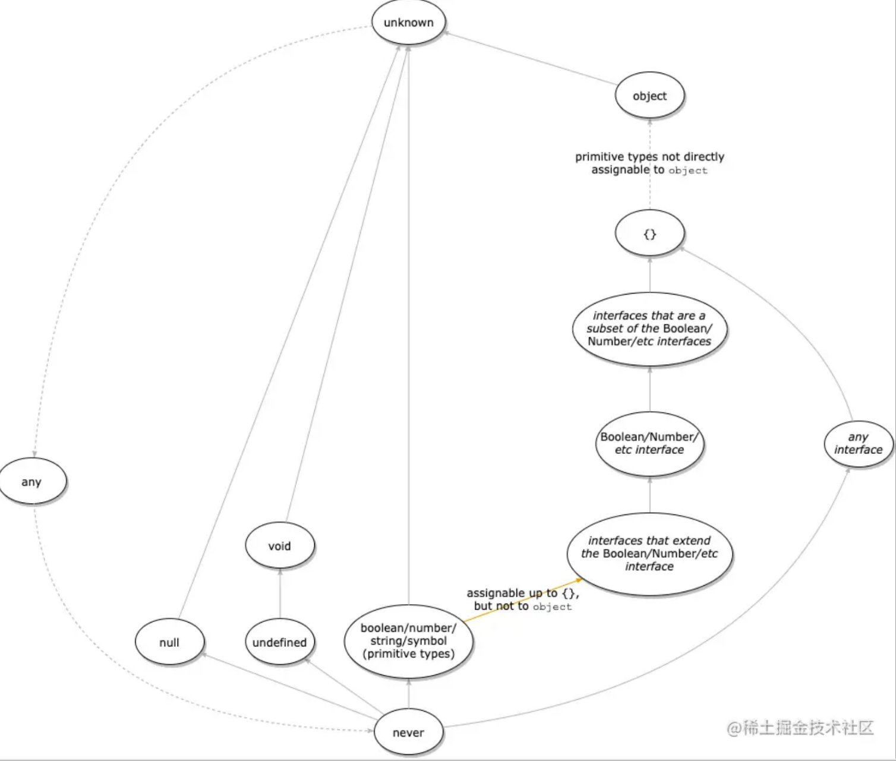
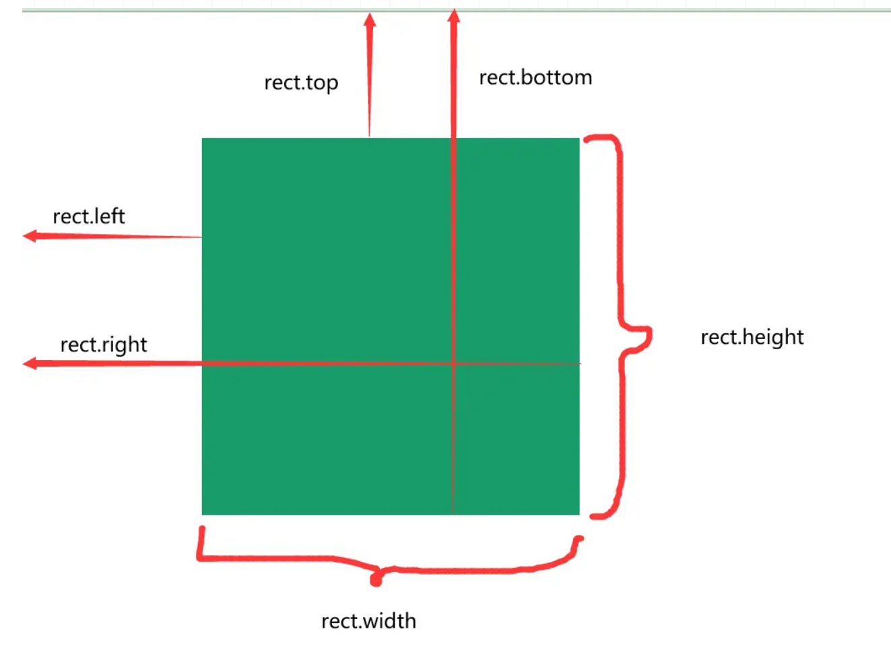

- [filter(滤镜)](#filter滤镜)
- [git撤回已经提交的push](#git撤回已经提交的push)
- [16进制转rgb颜色](#16进制转rgb颜色)
- [js内存泄漏](#js内存泄漏)
- [手动内存管理的最佳实践](#手动内存管理的最佳实践)
- [e2e测试](#e2e测试)
- [常用ts程序类型](#常用ts程序类型)
- [??=](#)
- [??](#-1)
- [compilerOptions选项](#compileroptions选项)
- [如何在react工程里使用阿里图标库的图标](#如何在react工程里使用阿里图标库的图标)
- [原型/原型链](#原型原型链)
- [端口被占用](#端口被占用)
- [cookie、localStorage、sessionStorage、indexedDB](#cookielocalstoragesessionstorageindexeddb)
- [ts tips](#ts-tips)
- [Symbol](#symbol)
- [\_lodash中好用的函数](#_lodash中好用的函数)
- [getBoundingClientRect()](#getboundingclientrect)
- [intersectionObserver](#intersectionobserver)
- [createNodeIterator()](#createnodeiterator)
- [requestAnimationFrame()](#requestanimationframe)


### filter(滤镜)

+ none: 默认值。
+ blur(): 给图像设置高斯模糊。  blur(5px)
+ brightness(): 给图片应用一种线性乘法，使其看起来更亮或更暗。
+ contrast(): 调整图像的对比度。
+ drop-shadow(): 给图像设置一个阴影效果
+ grayscale(): 将图像转换为灰度图像。
+ hue-rotate(): 给图像应用色相旋转。
+ invert(): 反转输入图像。
+ opacity(): 转化图像的透明程度。
+ saturate(): 转换图像饱和度。
+ sepia(): 将图像转换为深褐色。
+ url(): URL函数接受一个XML文件，该文件设置了一个SVG滤镜，且可以包含一个锚点来指定一个具体的滤镜元素。


### git撤回已经提交的push
+ ``` git reset --hard commitId ```
+ ``` git push origin 分支 --force ```

### 16进制转rgb颜色
``` javascript
        hexToRgb: function (val) {   //HEX十六进制颜色值转换为RGB(A)颜色值
                // 16进制颜色值的正则
            var reg = /^#([0-9a-fA-f]{3}|[0-9a-fA-f]{6})$/;
            // 把颜色值变成小写
            var color = val.toLowerCase();
            var result = '';
            if (reg.test(color)) {
                // 如果只有三位的值，需变成六位，如：#fff => #ffffff
                if (color.length === 4) {
                    var colorNew = "#";
                    for (var i = 1; i < 4; i += 1) {
                        colorNew += color.slice(i, i + 1).concat(color.slice(i, i + 1));
                    }
                    color = colorNew;
                }
                // 处理六位的颜色值，转为RGB
                var colorChange = [];
                for (var i = 1; i < 7; i += 2) {
                    colorChange.push(parseInt("0x" + color.slice(i, i + 2)));
                }
                result = "rgb(" + colorChange.join(",") + ")";
                return { rgb: result, r: colorChange[0], g: colorChange[1], b: colorChange[2] };
            } else {
                result = '无效';
                return { rgb: result };
            }
        }
```

### js内存泄漏
1. 循环引用
  ```javascript
    let obj1 = {};
    let obj2 = {};
    obj1.next = obj2;
    obj2.prev = obj1;

    obj1 = null;
    obj2 = null;

    <!-- 将 obj1 和 obj2 设置为 null 以打破循环引用，但由于垃圾收集器无法打破循环引用，因此对象将在不再需要后很长时间内保留在内存中，从而导致内存泄漏。为了避免这种类型的内存泄漏，我们可以使用一种称为“手动内存管理”的技术，通过使用 JavaScript 的 delete 关键字来删除创建循环引用的属性。 -->

    delete obj1.next;
    delete obj2.prev;

  ```
2. 事件监听器
  ```javascript
    let button = document.getElementById("my-button");
    button.addEventListener("click", function() {
        console.log("Button was clicked!");
    });

    <!-- 方法一： -->
    button.removeEventListener("click", function() {
        console.log("Button was clicked!");
    });
    <!-- 方法二： -->
    button.removeAllListeners();
  ```
3. 全局变量
   使用let const，在一定区域内使用

### 手动内存管理的最佳实践
1. 使用弱引用
   weakMap、weakSet
   ```let weakMap = new WeakMap(); weakMap.set(object1, "some data");```
2. 使用垃圾收集器 API
   ```gc()```
3. 使用堆快照和分析器
   ```javascript
    <!-- 在执行将大数据推送到数组的循环之前和之后拍摄两个堆快照，然后，比较这两个快照以识别在循环期间创建的对象。 接着，我们可以分析差异以查看哪些对象使用了最多的内存，这可以帮助我们识别由大数据引起的内存泄漏。 -->
    let snapshot1 = performance.heapSnapshot();
    // Do some actions that might cause memory leaks
    for (let i = 0; i < 100000; i++) {
      myArray.push({
        largeData: new Array(1000000).fill("some data"),
        id: i
      });
    }

    let snapshot2 = performance.heapSnapshot();
    let diff = snapshot2.compare(snapshot1);
    diff.forEach(function(item) {
      if (item.size > 1000000) {
        console.log(item.name);
      }
    });

    <!-- 使用 JavaScript 分析器来开始和停止跟踪我们应用程序的性能。该报告将显示有关已调用函数的信息以及每个函数的内存使用情况。 -->
    let profiler = new Profiler();
    profiler.start();
    // do some actions that might cause memory leaks
    for (let i = 0; i < 100000; i++) {
      myArray.push({
        largeData: new Array(1000000).fill("some data"),
        id: i,
      });
    }
    profiler.end();
    let report = profiler.report();
    // analyze the report to identify areas where memory usage is high
    for (let func of report) {
      if (func.memory > 1000000) {
        console.log(func.name);
      }
    }
   ```

### e2e测试
关注一个完整的操作链能否完成。

### 常用ts程序类型
1. 所有属性设置为可选
  ``` typescript
  type Partial<T> = {
    [P in keyof T]?: T[P]
  };
  ```
2. 由设置为必需的 Type 的所有属性组成，与 Partial 相反。
  ```typescript
  type Required<T> = {
      [P in keyof T]-?: T[P];
  };

  type User = {
    name?: string;
    password?: string;
  };
  type RequiredUser = Required<User>;
  ```

3. 构造一个 Type 的所有属性都设置为只读的类型，这意味着不能重新分配构造类型的属性。
  ```typescript
  type Readonly<T> = {
    readonly [P in keyof T]: T[P];
  };
  ```

4. 构造一个对象类型，其属性键为 Keys，其属性值为 Type，该实用程序可用于将一种类型的属性映射到另一种类型。
  ```typescript
  type Record<K extends keyof any, T> = {
    [P in K]: T;
  };

  type User = {
    name: string;
    password: string;
  };
  type UserIds = 1000 | 1001 | 1002;
  type UserMap1 = {
    1000: User;
    1001: User;
    1002: User;
  };
  type UserMap = Record<UserIds, User>;
  ```

5. 通过从 UnionType 中排除所有可分配给 ExcludedMembers 的联合成员来构造一个类型。
   ```typescript
   type Exclude<T, U> = T extends U ? never : T;
   ```
6. 通过从 Type 中提取可分配给 Union 的所有联合成员来构造一个类型。
   ```typescript
   type Extract<T, U> = T extends U ? T : never;
   ```

7. 通过从 Type 中选择一组属性键（字符串文字或字符串文字的并集）来构造一个类型。
   ```typescript
    type Pick<T, K extends keyof T> = {
    	[P in K]: T[P];
    };
   ```

8. 通过从 Type 中选择所有属性然后删除键（字符串文字或字符串文字的并集）来构造一个类型。
   ```typescript
   type Omit<T, K extends keyof any> = Pick<T, Exclude<keyof T, K>>;
   ```

9. 通过从 Type 中排除 null 和 undefined 来构造一个类型。
    ```typescript
	type NonNullable<T> = T extends null | undefined ? never : T;
	```

10. 根据函数类型 Type 的参数中使用的类型构造元组类型。
    ```typescript
	type Parameters<T extends (...args: any) => any> = T extends
  		(...args: infer P) => any ? P : never;
	```


### ??=
只有当??=左侧的值为undefined、null时，才会把右侧的值赋给左侧，否则左侧不会被赋值

### ??
只有当??左侧为null或undefined时，才会返回右侧的值，否则返回左侧值

### compilerOptions选项
```json
{
  "compilerOptions": {

    /* 基本选项 */
    "target": "es5",                       // 指定 ECMAScript 目标版本: 'ES3' (default), 'ES5', 'ES6'/'ES2015', 'ES2016', 'ES2017', or 'ESNEXT'
    "module": "commonjs",                  // 指定使用模块: 'commonjs', 'amd', 'system', 'umd' or 'es2015'
    "lib": [],                             // 指定要包含在编译中的库文件
    "allowJs": true,                       // 允许编译 javascript 文件
    "checkJs": true,                       // 报告 javascript 文件中的错误
    "jsx": "preserve",                     // 指定 jsx 代码的生成: 'preserve', 'react-native', or 'react'
    "declaration": true,                   // 生成相应的 '.d.ts' 文件
    "sourceMap": true,                     // 生成相应的 '.map' 文件
    "outFile": "./",                       // 将输出文件合并为一个文件
    "outDir": "./",                        // 指定输出目录
    "rootDir": "./",                       // 用来控制输出目录结构 --outDir.
    "removeComments": true,                // 删除编译后的所有的注释
    "noEmit": true,                        // 不生成输出文件
    "importHelpers": true,                 // 从 tslib 导入辅助工具函数
    "isolatedModules": true,               // 将每个文件做为单独的模块 （与 'ts.transpileModule' 类似）.

    /* 严格的类型检查选项 */
    "strict": true,                        // 启用所有严格类型检查选项
    "noImplicitAny": true,                 // 在表达式和声明上有隐含的 any类型时报错
    "strictNullChecks": true,              // 启用严格的 null 检查
    "noImplicitThis": true,                // 当 this 表达式值为 any 类型的时候，生成一个错误
    "alwaysStrict": true,                  // 以严格模式检查每个模块，并在每个文件里加入 'use strict'

    /* 额外的检查 */
    "noUnusedLocals": true,                // 有未使用的变量时，抛出错误
    "noUnusedParameters": true,            // 有未使用的参数时，抛出错误
    "noImplicitReturns": true,             // 并不是所有函数里的代码都有返回值时，抛出错误
    "noFallthroughCasesInSwitch": true,    // 报告 switch 语句的 fallthrough 错误。（即，不允许 switch 的 case 语句贯穿）

    /* 模块解析选项 */
    "moduleResolution": "node",            // 选择模块解析策略： 'node' (Node.js) or 'classic' (TypeScript pre-1.6)
    "baseUrl": "./",                       // 用于解析非相对模块名称的基目录
    "paths": {},                           // 模块名到基于 baseUrl 的路径映射的列表
    "rootDirs": [],                        // 根文件夹列表，其组合内容表示项目运行时的结构内容
    "typeRoots": [],                       // 包含类型声明的文件列表
    "types": [],                           // 需要包含的类型声明文件名列表
    "allowSyntheticDefaultImports": true,  // 允许从没有设置默认导出的模块中默认导入。

    /* Source Map Options */
    "sourceRoot": "./",                    // 指定调试器应该找到 TypeScript 文件而不是源文件的位置
    "mapRoot": "./",                       // 指定调试器应该找到映射文件而不是生成文件的位置
    "inlineSourceMap": true,               // 生成单个 soucemaps 文件，而不是将 sourcemaps 生成不同的文件
    "inlineSources": true,                 // 将代码与 sourcemaps 生成到一个文件中，要求同时设置了 --inlineSourceMap 或 --sourceMap 属性

    /* 其他选项 */
    "experimentalDecorators": true,        // 启用装饰器
    "emitDecoratorMetadata": true          // 为装饰器提供元数据的支持
  }
}
```

### 如何在react工程里使用阿里图标库的图标
1. 阿里图标库找到图标，添加进自己的项目
2. 进入项目，左上角选Symbol，点击“收起在线链接”
3. 记得批量去色
4. 复制代码类似于“//at.alicdn.com/t/c/font_4012350_z9rj1mqd3e.js”
5. 按照 [官方文档](https://ant.design/components/icon-cn#%E8%87%AA%E5%AE%9A%E4%B9%89-icon) 引入


### 原型/原型链
proto、prototype、constructor

+ js对象分为：普通对象、函数对象
+ *__proto__*和*constructor*是对象独有的。*prototype*是函数独有的。在js中，函数也是对象，所有函数也有*__proto__*和*constructor*
+ *constructor*，该对象的构造函数.*prototype*.*constructor* === 该构造函数本身
+ 一个对象的*__proto__*指向其构造函数的prototype，函数创建的对象.*__proto__* === 该函数.*prototype*

### 端口被占用
```
netstat -ano|findstr "3000"
taskkill -PID 16556 -f
```

### cookie、localStorage、sessionStorage、indexedDB
|特性|cookie|localStorage|sessionStorage|indexDB
|:-|:-|:-|:-|:-
|数据生命周期|一般由服务器生成，可以设置过期时间；前端采用js-cookie等组件也可以生成|除非被清理，否则一直存在；浏览器关闭依然保存再本地，但是不支持跨浏览器|页面关闭就清理刷新，不支持跨浏览器|除非被清理，否则一直存在
|数据存储大小|4k|5M|5M|不限大小
|与服务端通信|每次都会携带在请求的header中，同时由于请求携带，容易有安全问题|不参与|不参与|不参与
|特点|字符串键值对在本地存储数据|字符串键值对在本地存储数据|字符串键值对在本地存储数据|indexDB是一个非关系型数据库（不支持通过SQL语句操作）。可以存储大量数据，提供接口来查询，还可以建立索引，这些都是其它存储方案无法提供的能力

### ts tips
+ 类型关系



### Symbol
+ Symbol是js中的原始数据类型之一，它表示一个唯一的、不可变的值，通常用作对象属性的键值。
+ Symbol.length = 0
+ Symbol.for(): 根据给定的字符串key，返回一个已经存在的symbol值。如果不存在，则会创建一个新的Symbol值并将其注册到全局Symbol注册表中。当我们需要使用一个全局唯一的Symbol值时，可以使用Symbol.for()方法来获取或创建该值。
  ```javascript
  const symbol1 = Symbol.for('foo');
  const symbol2 = Symbol.for('foo');

  console.log(symbol1 === symbol2); // true

  ```
+ Symbol.keyFor(): 会返回一个已经存在的Symbol值的key。如果给定的Symbol值不存在于全局Symbol注册表中，则返回undefined。
+ Symbol(): 返回一个新的、唯一的Symbol值。可以使用可选参数description来为Symbol值添加一个描述信息。

### _lodash中好用的函数
+ chunk 将一个数组按照指定的大小分割成若干数组，返回一个新的二维数组
  ```javascript
  const arr = ['a', 'b', 'c', 'd', 'e'];
  console.log(_.chunk(arr, 3)); // [['a', 'b', 'c'], ['d', 'e']]
  ```
+ compact 将数组中的falsy值去除（false、null、0、""、undecided、NaN）
  ```javascript
  const arr = ['a', 0, '', null, undefined, NaN, 'b'];
  console.log(_.compact(arr)); // ['a', 'b']
  ```
+ difference 返回两个数组之间的差异 在第一个数组中但不在第二个数组中的所有值组成的数组
+ drop 从数据中删除前面指定的n个元素
  ```javascript
  const arr = [1, 2, 3, 4, 5];
  console.log(_.drop(arr, 2)); // [3, 4, 5]
  ```
+ dropRight
+ intersection 返回两个或多个数组之间的交集
  ```javascript
  const arr1 = ['a', 'b'];
  const arr2 = ['b', 'c'];
  const arr3 = ['b', 'd'];
  console.log(_.intersection(arr1, arr2, arr3)); // ['b']
  ```
+ omit 删除一个对象中指定的属性，并返回一个新的对象
+ pick 选择一个对象中指定的属性，并返回一个新的对象
+ capitalize 将第一个字符转换大写，其余转换小写
+ repeat 将一个字符串重复n次，并返回一个新字符串 _.repeat(string = '', [n=1])
+ memoize(func, [resolver]) 对一个函数进行记忆处理，缓存该函数的计算结果
+ curry(func, [arity = func.length]) 将一个函数转换为柯里化函数，即逐步传入参数并返回一个新函数


### getBoundingClientRect()
+ 一个用于获取元素位置和尺寸信息的方法。返回一个DOMRect对象，提供了元素的大小和其相对于视口的位置。
+ x：元素左边距相对于视口的x坐标
+ y：元素右边距相对于视口的y坐标
+ width：元素的宽度
+ height：元素的高度
+ top：元素上边界相对于视口顶部的距离。
+ right：元素右边界相对于视口左侧的距离。
+ bottom：元素下边界相对于视口顶部的距离。
+ left：元素左边界相对于视口左侧的距离
+ 这个方法通常用于需要获取元素在视口中的位置和尺寸信息的场景，比如实现拖拽、定位或响应式布局等，兼容性很好，一般用滚动事件比较多。
+ 判断一个容器是否出现在可视窗口内：
  ```JavaScript
  const box = document.getElementById('box');
  window.onscroll = function () {
    console.log(checkInView(box));
  }

  function checkInView(dom) {
    const { top, left, bottom, right } = dom.getBoundingClientRect();
    return top > 0 && left > 0 && bottom <= (window.innerHeight || document.documentElement.clientHeight) && right <= (window.innerWidth || document.documentElement.clientWidth);
  }
  ```
  

### intersectionObserver
+ 是一个构造函数，接受两个参数，第一个参数是回调函数，第二个参数动是一个对象。这个方法用于观察元素相交情况，它可以异步地监听一个或多个目标元素与其祖先元素或视口之间的交叉状态。它提供了一种有效的方法来检测元素是否可见或进入视口。
1. 创建一个 IntersectionObserver 实例，传入一个回调函数和可选的配置对象。
  ```javascript
  const observer = new IntersectionObserver(callback, options);
  const callback = (entries, observer) => {
    // 处理交叉状态变化的回调函数
  }

  const options = {
    // 可选配置
  };
  ```
2. 将要观察的元素添加到观察者中
  ```javascript
  const target = document.querySelector('#targetElement');
  observer.observe(target);
  ```
3. 在回调函数中处理交叉状态的变化
  ```javascript
  const callback = (entries, observer) => {
    entries.foreach(entry => {
      if (entry.inIntersecting) {
        // 元素进入视口
      } else {
        // 元素离开视口
      }
    })
  }
  ```
+ entries 参数是一个包含每个目标元素交叉状态信息的数组。每个 entry 对象都有以下属性：

+ target：观察的目标元素。
+ intersectionRatio：目标元素与视口的交叉比例，值在 0 到 1 之间。
+ isIntersecting：目标元素是否与视口相交。
+ intersectionRect：目标元素与视口的交叉区域的位置和尺寸信息。

+ options 对象是可选的配置，其中常用的配置选项包括：

+ root：指定观察器的根元素，默认为视口。
+ rootMargin：设置根元素的外边距，用于扩大或缩小交叉区域。
+ threshold：指定交叉比例的阈值，可以是单个数值或由多个数值组成的数组。

+ IntersectionObserver 适用于实现懒加载、无限滚动、广告展示和可视化统计等场景，同样可以判断元素是否在某一个容器内，不会引起回流。

### createNodeIterator()
+ DOM API中的一个方法，用户创建一个NodeIterator对象，可以用于遍历文档树种的一组DOM节点。通俗一点来讲就是它可以遍历 DOM 结构，把 DOM 变成可遍历的。

### requestAnimationFrame()
+ 在下一次浏览器重绘之前调用指定函数的方法，它是HTML5提供的API
+ requestAnimationFrame的调用频率通常为每秒60次。这意味着我们可以在每次重绘之前更新动画的状态，并确保动画流畅运行，而不会对浏览器的性能造成影响。setInterval与setTimeout它可以让我们在指定的时间间隔内重复执行一个操作，不会考虑浏览器的重绘，而是按照指定的时间间隔执行回调函数，可能会被延迟执行，从而影响动画的流畅度。
+ 我们设置了两个容器，分别用requestAnimationFrame()方法和setTimeout方法进行平移效果，Js 代码如下所示：
```javascript
  let distance = 0
  let box = document.getElementById('box')
  let box2 = document.getElementById('box2')

  window.addEventListener('click', function () {

    requestAnimationFrame(function move() {
      box.style.transform = `translateX(${distance++}px)`
      requestAnimationFrame(move)//递归
    })

  setTimeout(function change() {
    box2.style.transform = `translateX(${distance++}px)`
      setTimeout(change, 17)
        }, 17)
  })

```